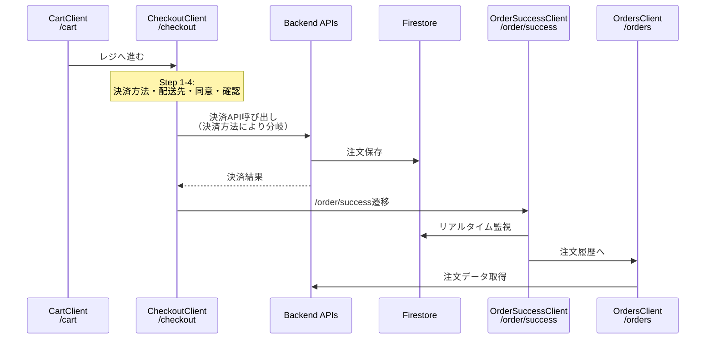
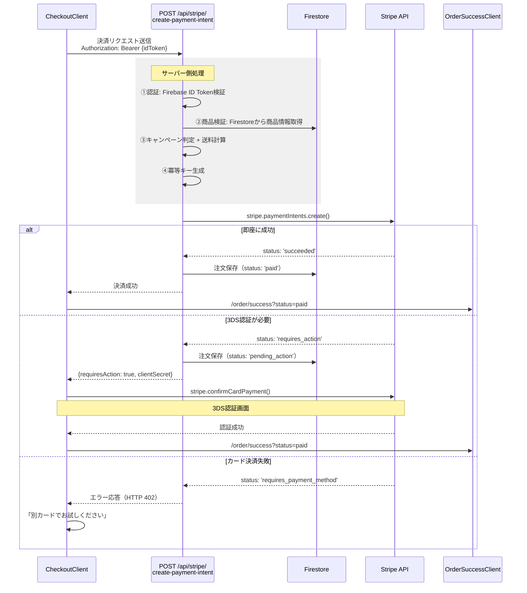
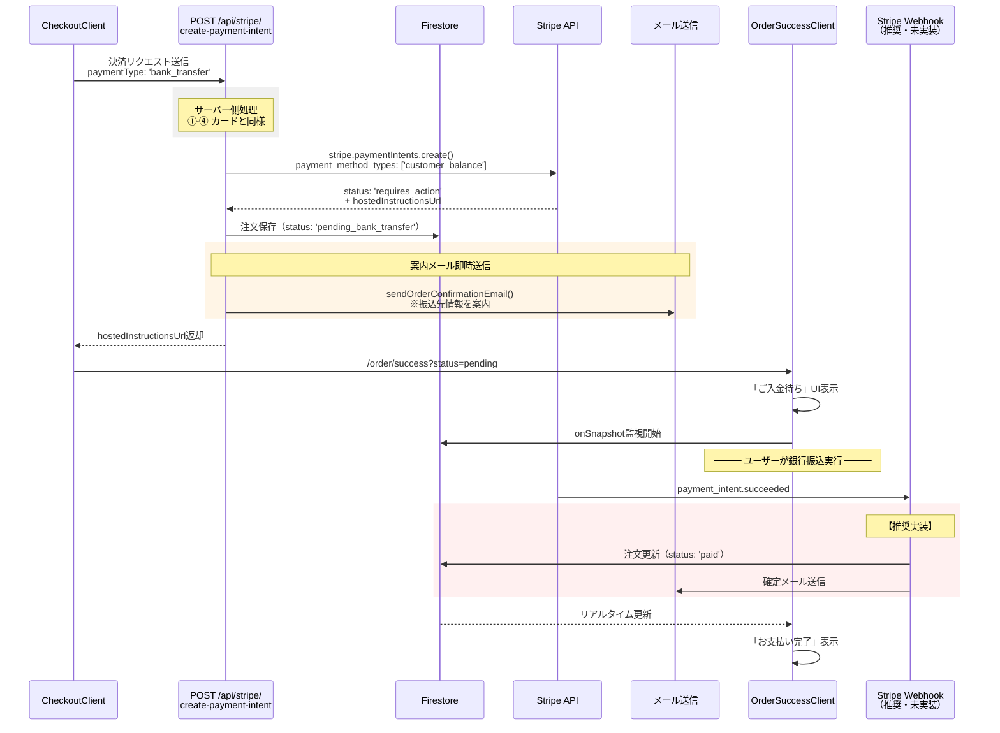
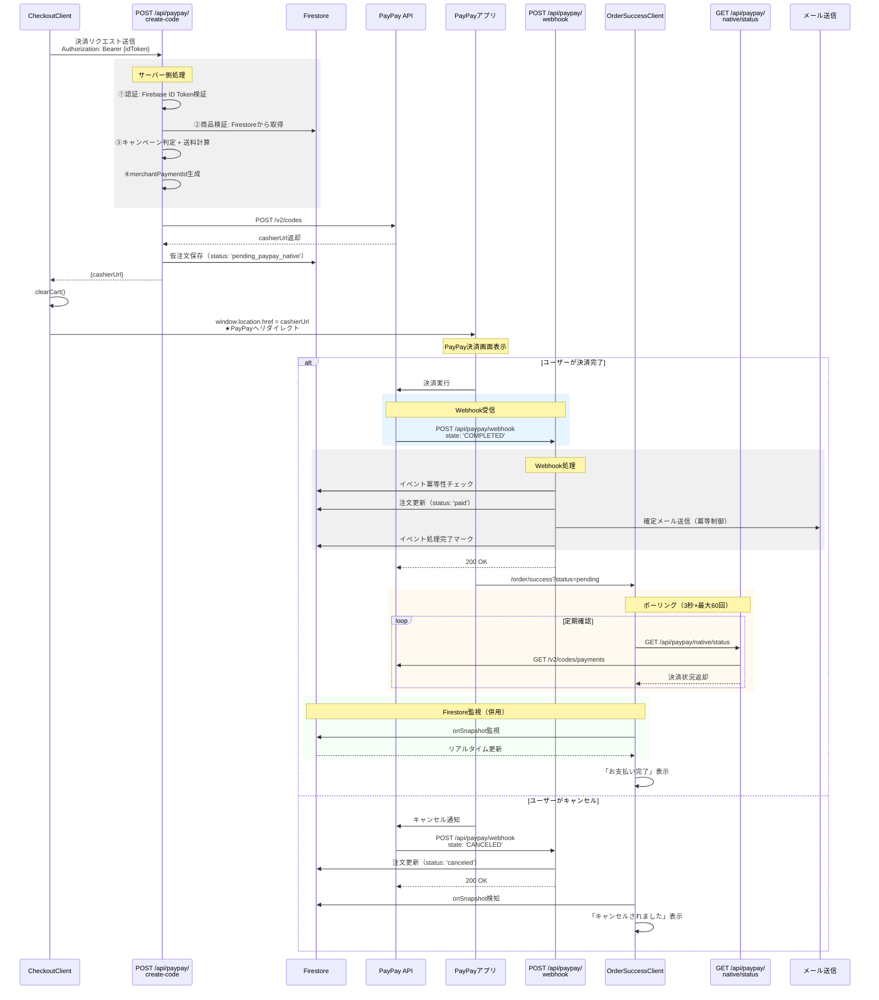
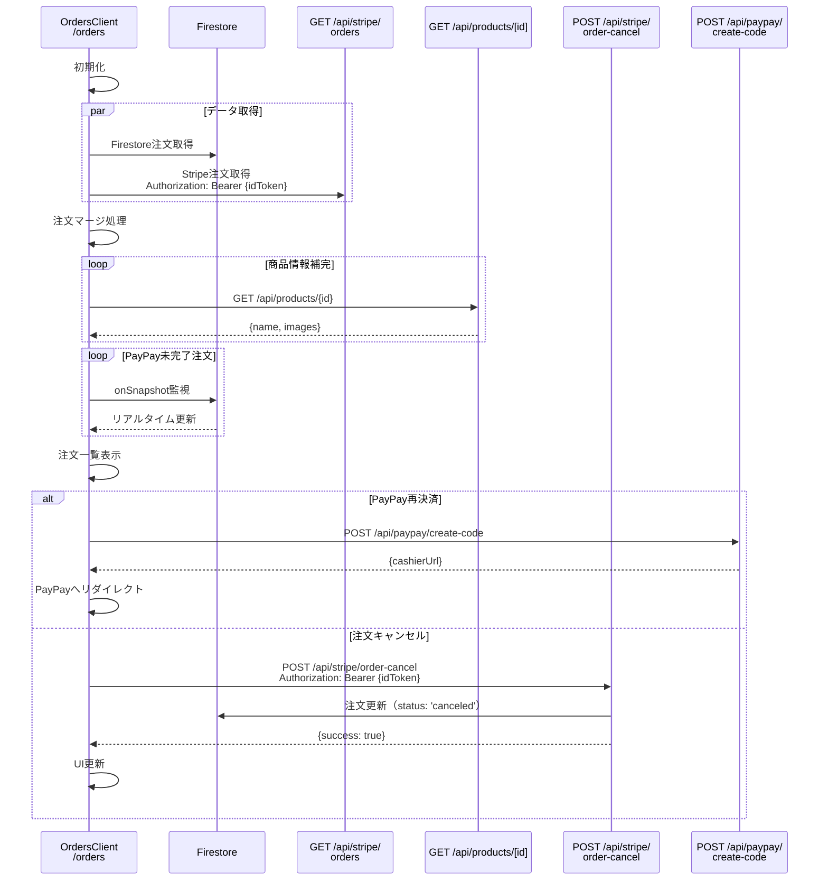

# PLAY TUNE STORE - Checkout処理

---

## 全体フロー（外観）



**💡基本的にはCart / Checkout / OrderSuccess / Orders + API/Webhookを更新すれば決済手段の追加ができる。** </br>
**💡便宜上銀行振込やPayPayなど決済が即確定しないものもOrderSuccessに遷移。PaymentMethodで分岐させて、カード決済以外は基本的にステータス確認機能を兼ねている。**　</br>
**💡実際のステータス更新はWebhookで処理**</br>
**💡メールは/lib/mailer.tsで送付。**


---

## 決済方法別フロー：カード決済



---

## 決済方法別フロー：銀行振込



---

## 決済方法別フロー：PayPay決済



---

## OrdersClient: 注文履歴データ取得フロー



---

## 新規決済方法追加：一般的な実装パターン

### 1. 認証とセキュリティ

#### Firebase ID Token認証
```typescript
// すべての決済APIで必須
async function requireUid(req: NextRequest): Promise<string> {
  const authz = req.headers.get('authorization') || ''
  const match = authz.match(/^Bearer\s+(.+)$/i)
  if (!match) throw new Error('unauthorized')
  
  const idToken = match[1]
  const decoded = await getAuth().verifyIdToken(idToken)
  return decoded.uid
}
```

**重要ポイント**:
- クライアントから送信されたuserIdは信用しない
- 必ずサーバー側でFirebase ID Tokenを検証
- 検証済みのuidを使用して処理

---

### 2. 商品情報の検証

#### クライアントデータを信用しない
```typescript
// ❌ 悪い例：クライアントの価格をそのまま使用
const total = items.reduce((sum, item) => sum + item.price * item.quantity, 0)

//  良い例：Firestoreから商品情報を再取得
async function fetchProductsMap(productIds: string[]): Promise<Map<string, ProductDoc>> {
  const refs = productIds.map(id => adminDb.collection('products').doc(id))
  const snaps = await adminDb.getAll(...refs)
  
  const map = new Map<string, ProductDoc>()
  snaps.forEach((snap, i) => {
    if (snap.exists) {
      map.set(productIds[i], snap.data() as ProductDoc)
    }
  })
  return map
}

// 検証例
const products = await fetchProductsMap(items.map(i => i.id))
for (const item of items) {
  const product = products.get(item.id)
  if (!product) {
    throw new Error(`Product not found: ${item.id}`)
  }
  
  // 価格の検証（オプション：本番環境推奨）
  if (item.price !== product.price) {
    console.warn(`Price mismatch for ${item.id}`)
    // 必要に応じてDB価格を優先
  }
}
```

**検証項目**:
-  商品の存在確認
-  商品の価格検証（推奨）
-  在庫確認（オプション）
-  キャンペーン適用条件の判定

---

### 3. キャンペーン/送料計算ロジック

#### サーバー側で完全に計算
```typescript
async function computeTotalsServerSide(items: IncomingItem[]) {
  // ①商品情報取得
  const products = await fetchProductsMap(items.map(i => i.id))
  
  // ②小計計算（現状はクライアント価格、本番ではDB価格推奨）
  const subtotal = items.reduce((sum, it) => 
    sum + it.price * it.quantity, 0
  )
  
  // ③配送必要判定
  const hasShippingItems = items.some(it => {
    const prod = products.get(it.id)
    return it.requiresShipping ?? prod?.requiresShipping ?? false
  })
  
  // ④キャンペーン判定（例：Feel it）
  const hasCampaignItem = items.some(it => {
    const prod = products.get(it.id)
    // 商品名またはタグで判定
    const nameHit = 
      includesKeyword(it.name, 'feel it') || 
      includesKeyword(prod?.name, 'feel it')
    const tagHit = 
      arrayHasKeyword(it.tags, 'feel it') || 
      arrayHasKeyword(prod?.tags, 'feel it')
    return nameHit || tagHit
  })
  
  // ⑤送料計算
  const FIXED_SHIPPING_FEE = 800
  const FREE_SHIPPING_THRESHOLD = 10_000
  
  const shippingFee = 
    hasShippingItems && hasCampaignItem && subtotal >= FREE_SHIPPING_THRESHOLD
      ? 0
      : hasShippingItems
      ? FIXED_SHIPPING_FEE
      : 0
  
  // ⑥合計
  const total = subtotal + shippingFee
  
  return { subtotal, shippingFee, total }
}
```

**重要ポイント**:
-  キャンペーン判定はサーバー側で実施
-  クライアント側の計算は参考値（UI表示用）
-  決済時はサーバー側の計算結果を使用

---

### 4. 冪等性の実装

#### 二重決済を防ぐ

```typescript
// ①冪等キーの生成
import crypto from 'node:crypto'

function generateIdempotencyKey(uid: string, items: any[], total: number): string {
  // uidとitemsと金額とタイムスタンプでハッシュ生成
  // ※タイムスタンプを含めることで短時間の連打は防ぐが、時間経過後の再注文は許可
  const payload = JSON.stringify({
    uid,
    items: items.map(i => ({ id: i.id, quantity: i.quantity, price: i.price })),
    total,
    timestamp: Math.floor(Date.now() / 60000) // 1分単位
  })
  
  return crypto
    .createHash('sha256')
    .update(payload)
    .digest('hex')
}

// ②決済API呼び出し時に使用
const idempotencyKey = generateIdempotencyKey(uid, items, total)

await stripe.paymentIntents.create(
  { amount: total, /* ... */ },
  { idempotencyKey } // Stripeが自動で重複チェック
)
```

**冪等性の保証方法**:
-  **Stripe**: `idempotencyKey`パラメータで自動重複チェック
-  **PayPay**: `merchantPaymentId`で一意性を保証（UUID使用）
-  **一般的な決済**: トランザクションIDをユニークに生成

---

### 5. Webhookのベストプラクティス

#### イベント冪等性チェック

```typescript
// ①イベントID生成
function generateEventId(payload: WebhookPayload): string {
  // プロバイダ、注文ID、イベントタイプ、タイムスタンプで一意化
  return [
    'provider_name',
    payload.orderId || payload.merchant_order_id,
    payload.eventType || payload.state,
    payload.timestamp || payload.paid_at || Date.now()
  ].join(':')
}

// ②冪等性チェック
async function markIfNew(eventId: string, rawPayload: any): Promise<boolean> {
  const ref = adminDb.collection('webhookEvents').doc(eventId)
  const snap = await ref.get()
  
  if (snap.exists) {
    console.log('Event already processed:', eventId)
    return false // 既処理
  }
  
  // 新規イベントとして記録
  await ref.set({
    id: eventId,
    provider: 'provider_name',
    createdAt: Timestamp.now(),
    handled: false,
    raw: rawPayload // 監査用
  })
  
  return true // 新規
}

// ③処理完了マーク
async function setHandled(eventId: string) {
  await adminDb.collection('webhookEvents').doc(eventId).set(
    {
      handled: true,
      handledAt: Timestamp.now()
    },
    { merge: true }
  )
}

// ④Webhook処理の基本構造
export async function POST(req: NextRequest) {
  try {
    const body = await req.json()
    
    // 署名検証（プロバイダごとに異なる）
    if (!verifySignature(body, req.headers.get('signature'))) {
      return new NextResponse('Invalid signature', { status: 401 })
    }
    
    // イベント冪等性チェック
    const eventId = generateEventId(body)
    const isNew = await markIfNew(eventId, body)
    
    if (!isNew) {
      return new NextResponse('OK', { status: 200 }) // 重複イベントはスキップ
    }
    
    // 注文ステータス更新
    const orderId = body.orderId || body.merchant_order_id
    await updateOrderStatus(orderId, body)
    
    // 必要に応じてメール送信
    if (body.eventType === 'PAYMENT_COMPLETED') {
      await sendConfirmationEmailIfNeeded(orderId)
    }
    
    // 処理完了マーク
    await setHandled(eventId)
    
    // 必ず200 OKを返す（再送ループを防ぐ）
    return new NextResponse('OK', { status: 200 })
    
  } catch (error) {
    console.error('Webhook error:', error)
    // エラーでも200を返す（運用方針による）
    return new NextResponse('OK', { status: 200 })
  }
}
```

**Webhookの重要ポイント**:
-  **署名検証**: プロバイダからの正当な通知か確認
-  **イベント冪等性**: 同じイベントを複数回処理しない
-  **200 OK返却**: 必ず成功応答（再送ループを防ぐ）
-  **エラーハンドリング**: 例外でも200を返す（運用方針による）
-  **監査ログ**: rawペイロードを保存

---

### 6. メール送信の冪等制御

```typescript
async function sendConfirmationEmailIfNeeded(orderId: string) {
  // ①注文情報取得
  const orderRef = adminDb.collection('orders').doc(orderId)
  const snap = await orderRef.get()
  
  if (!snap.exists) return
  
  const order = snap.data()
  
  // ②既送信チェック
  if (order?.paidEmailSent === true) {
    console.log('Email already sent for order:', orderId)
    return
  }
  
  // ③ユーザー情報取得
  const userId = order?.userId
  if (!userId) return
  
  const userSnap = await adminDb.collection('users').doc(userId).get()
  const user = userSnap.data()
  const email = user?.email
  
  if (!email) return
  
  // ④メール送信
  try {
    await sendOrderConfirmationEmail({
      to: email,
      userName: user?.displayName || email.split('@')[0],
      orderId,
      totalJPY: order.total,
      paymentType: order.paymentType,
      items: order.items,
      shippingFeeJPY: order.shippingFee,
      paidAt: new Date(),
      address: order.shippingInfo
    })
    
    // ⑤送信済みフラグ更新
    await orderRef.set(
      {
        paidEmailSent: true,
        paidEmailSentAt: Timestamp.now(),
        updatedAt: Timestamp.now()
      },
      { merge: true }
    )
    
    // ⑥ログ記録
    await adminDb.collection('emailLogs').add({
      type: 'order_confirmation',
      orderId,
      userId,
      recipient: email,
      status: 'sent',
      source: 'webhook', // or 'api'
      sentAt: Timestamp.now()
    })
    
  } catch (error) {
    console.error('Email send error:', error)
    
    // 失敗ログ
    await adminDb.collection('emailLogs').add({
      type: 'order_confirmation',
      orderId,
      status: 'failed',
      error: error instanceof Error ? error.message : String(error),
      sentAt: Timestamp.now()
    })
  }
}
```

**メール送信の重要ポイント**:
-  **冪等性**: `paidEmailSent`フラグで重複送信を防ぐ
-  **エラーハンドリング**: 失敗してもWebhook処理は続行
-  **ログ記録**: 成功/失敗を`emailLogs`コレクションに記録

---

### 7. データベース設計

#### ordersコレクション
```typescript
interface Order {
  // 基本情報
  id: string                    // PaymentIntent ID or merchantPaymentId
  userId: string                // Firebase UID
  
  // 商品情報
  items: OrderItem[]
  total: number                 // 合計（税込・送料込）
  subtotal: number              // 小計（商品合計）
  shippingFee: number           // 送料
  
  // ステータス
  status: 'pending' | 'pending_paypay' | 'pending_paypay_native' 
        | 'pending_bank_transfer' | 'processing' | 'shipped' 
        | 'delivered' | 'canceled' | 'expired' | 'failed'
  paymentStatus: 'pending' | 'requires_action' | 'requires_payment_method'
               | 'authorized' | 'succeeded' | 'paid' | 'failed' 
               | 'canceled' | 'expired' | 'refunded'
  
  // 決済情報
  paymentType: 'card' | 'bank_transfer' | 'paypay' | string
  paymentMethod?: {
    type: 'card'
    brand: string
    last4: string
  }
  
  // 配送情報
  shippingInfo?: {
    name: string
    prefecture: string
    city: string
    line1: string
    addressId?: string
  }
  trackingNumber?: string
  
  // PayPay固有（プロバイダごとに拡張）
  payPayNative?: {
    merchantPaymentId: string
    paymentId?: string
    paymentStatus: 'CREATED' | 'COMPLETED' | 'FAILED' | 'CANCELED'
  }
  provider?: string             // 'stripe', 'paypay_direct', etc.
  
  // 銀行振込固有
  hostedInstructionsUrl?: string
  
  // タイムスタンプ
  createdAt: Timestamp
  updatedAt: Timestamp
  paidAt?: Timestamp
  canceledAt?: Timestamp
  
  // メール送信管理
  paidEmailSent?: boolean       // 確定メール送信済みフラグ
  paidEmailSentAt?: Timestamp
}
```

#### webhookEventsコレクション
```typescript
interface WebhookEvent {
  id: string                    // 'provider:orderId:eventType:timestamp'
  provider: string              // 'paypay', 'linepay', 'stripe', etc.
  createdAt: Timestamp
  handled: boolean              // 処理済みフラグ
  handledAt?: Timestamp
  raw: object                   // 受信したペイロード全体（監査用）
}
```

**データベース操作のベストプラクティス**:
-  **Atomic更新**: `set({...}, {merge: true})`で部分更新
-  **タイムスタンプ管理**: `updatedAt`を常に更新
-  **ステータス履歴**: 重要な状態遷移時にタイムスタンプを記録
-  **監査ログ**: Webhookの生ペイロードを保存

---

### 8. リアルタイム状態更新

#### ポーリング vs Firestore監視

```typescript
// パターン1：ポーリング（非同期決済向け）
const pollPaymentStatus = async (orderId: string) => {
  const maxAttempts = 60 // 最大60回（3秒×60 = 3分）
  let attempts = 0

  const checkOnce = async () => {
    attempts++
    
    // 決済プロバイダAPIに状況確認
    const response = await fetch(`/api/provider/status?orderId=${orderId}`)
    const data = await response.json()
    
    if (data.status === 'completed') {
      // 成功：ポーリング終了
      setOrderStatus('paid')
      setIsPolling(false)
      return
    }
    
    if (data.status === 'failed' || data.status === 'cancelled') {
      // 失敗/キャンセル：ポーリング終了
      setOrderStatus(data.status)
      setIsPolling(false)
      return
    }
    
    // 継続
    if (attempts < maxAttempts) {
      setTimeout(checkOnce, 3000) // 3秒後に再試行
    } else {
      setPollingError('タイムアウト')
      setIsPolling(false)
    }
  }

  checkOnce()
}

// パターン2：Firestore監視（同期/非同期両対応）
useEffect(() => {
  if (!orderId) return
  
  const unsubscribe = onSnapshot(
    doc(db, 'orders', orderId),
    (snapshot) => {
      const data = snapshot.data()
      
      if (data?.paymentStatus === 'succeeded' || data?.paymentStatus === 'paid') {
        setOrderStatus('paid')
        router.replace(`/order/success?orderId=${orderId}&status=paid`)
      }
    },
    (error) => {
      // 権限エラー（未ログイン等）は握りつぶす
      console.warn('Firestore watch error:', error)
    }
  )
  
  return unsubscribe
}, [orderId])

// パターン3：併用（PayPay等）
// ポーリングで決済プロバイダを直接確認
// Firestore監視でWebhook経由の更新も検知
// → より確実なリアルタイム更新
```

**リアルタイム更新の使い分け**:
-  **同期決済（カード）**: Firestore監視のみ（または不要）
-  **非同期決済（銀行振込）**: Firestore監視のみ
-  **非同期決済（PayPay等）**: ポーリング + Firestore監視を併用

---

## エンドポイント詳細一覧

### 1. POST /api/stripe/customer

**用途**: Stripeカスタマーの作成または取得

**リクエスト**:
```json
{
  "userId": "firebase_uid",
  "email": "user@example.com"
}
```

**レスポンス**:
```json
{
  "customer": {
    "id": "cus_xxx",
    "email": "user@example.com",
    "metadata": {
      "firebaseUserId": "firebase_uid"
    }
  }
}
```

**処理内容**:
1. メールアドレスでStripe既存カスタマー検索
2. 存在する場合：FirebaseユーザーIDをメタデータに追加
3. 存在しない場合：新規カスタマー作成
4. カスタマー情報を返却

**認証**: ❌ 不要

---

### 2. GET /api/stripe/payment-methods

**用途**: 登録済みカード一覧の取得

**リクエスト**:
```
Query Parameters:
  customerId: cus_xxx (Stripe Customer ID)
```

**レスポンス**:
```json
{
  "paymentMethods": [
    {
      "id": "pm_xxx",
      "card": {
        "brand": "visa",
        "last4": "4242",
        "exp_month": 12,
        "exp_year": 2025
      }
    }
  ]
}
```

**処理内容**:
1. Stripe APIでカスタマーの登録カード一覧取得
2. カード情報（ブランド、末尾4桁、有効期限）を返却

**認証**: ❌ 不要（ただしcustomerIdが必要）

---

### 3. POST /api/stripe/setup-intent

**用途**: 新しいカード追加用のSetupIntent作成

**リクエスト**:
```json
{
  "customerId": "cus_xxx"
}
```

**レスポンス**:
```json
{
  "clientSecret": "seti_xxx_secret_xxx"
}
```

**処理内容**:
1. Stripe SetupIntent作成
2. payment_method_types: ['card']
3. clientSecretを返却
4. クライアント側でStripe Elementsを使用してカード登録

**認証**: ❌ 不要

---

### 4. POST /api/stripe/create-payment-intent

**用途**: カード/銀行振込決済の実行

**リクエスト**:
```json
{
  "items": [
    {
      "id": "product_id",
      "name": "商品名",
      "price": 3500,
      "quantity": 1,
      "requiresShipping": true,
      "selectedOptions": [
        {
          "optionId": "color",
          "optionName": "カラー",
          "valueId": "black",
          "valueName": "ブラック",
          "priceModifier": 0
        }
      ],
      "tags": ["feel it"]
    }
  ],
  "addressId": "addr_xxx",
  "address": {
    "name": "山田太郎",
    "prefecture": "東京都",
    "city": "渋谷区",
    "line1": "神南1-1-1",
    "postalCode": "150-0041"
  },
  "paymentType": "card" | "bank_transfer",
  "paymentMethodId": "pm_xxx"  // カード決済時のみ
}
```

**レスポンス（カード - 成功）**:
```json
{
  "paymentIntentId": "pi_xxx",
  "status": "succeeded",
  "clientSecret": "pi_xxx_secret_xxx"
}
```

**レスポンス（カード - 3DS必要）**:
```json
{
  "paymentIntentId": "pi_xxx",
  "status": "requires_action",
  "clientSecret": "pi_xxx_secret_xxx",
  "requiresAction": true
}
```

**レスポンス（カード - 失敗）**:
```json
{
  "error": "カードの認証/決済に失敗しました",
  "paymentIntentId": "pi_xxx",
  "status": "requires_payment_method"
}
```
HTTP Status: 402

**レスポンス（銀行振込）**:
```json
{
  "paymentIntentId": "pi_xxx",
  "status": "requires_action",
  "hostedInstructionsUrl": "https://payments.stripe.com/..."
}
```

**処理内容**:
1. Firebase ID Token検証 → uid取得
2. Firestoreから商品情報取得・検証
3. キャンペーン判定（Feel it等）
4. 送料計算
5. 冪等キー生成
6. Stripe PaymentIntent作成
   - カード: `payment_method`指定、`confirm: true`
   - 銀行振込: `payment_method_types: ['customer_balance']`
7. Firestore注文保存
8. 銀行振込の場合：案内メール即時送信
9. 決済結果を返却

**認証**:  必須（Authorization: Bearer {Firebase ID Token}）

---

### 5. GET /api/stripe/orders

**用途**: Stripe経由の注文履歴取得

**リクエスト**:
```
Headers:
  Authorization: Bearer {Firebase ID Token}
```

**レスポンス**:
```json
{
  "orders": [
    {
      "id": "pi_xxx",
      "userId": "firebase_uid",
      "items": [...],
      "total": 4300,
      "subtotal": 3500,
      "shippingFee": 800,
      "status": "processing",
      "paymentStatus": "succeeded",
      "paymentType": "card",
      "createdAt": "2025-01-15T10:00:00Z",
      "updatedAt": "2025-01-15T10:05:00Z",
      "paymentMethod": {
        "type": "card",
        "brand": "visa",
        "last4": "4242"
      }
    }
  ]
}
```

**処理内容**:
1. Firebase ID Token検証 → uid取得
2. Stripe APIでPaymentIntent一覧取得（metadata.uidで絞り込み）
3. 注文情報を整形して返却

**認証**:  必須

---

### 6. POST /api/stripe/order-cancel

**用途**: 注文のキャンセル

**リクエスト**:
```json
{
  "orderId": "pi_xxx"
}
```

**レスポンス**:
```json
{
  "success": true,
  "message": "注文をキャンセルしました"
}
```

**エラーレスポンス**:
```json
{
  "error": "この注文はキャンセルできません"
}
```
HTTP Status: 400

**処理内容**:
1. Firebase ID Token検証 → uid取得
2. Firestoreから注文取得
3. 所有者確認（orders.userId === uid）
4. キャンセル可能状態確認（pending系のみ）
5. Stripe PaymentIntentキャンセル
6. Firestore注文更新（status: 'canceled'）

**認証**:  必須

---

### 7. POST /api/paypay/create-code

**用途**: PayPay決済の開始

**リクエスト**:
```json
{
  "items": [
    {
      "id": "product_id",  // ★必須
      "name": "商品名",
      "price": 3500,
      "quantity": 1,
      "requiresShipping": true,
      "selectedOptions": [...],
      "tags": ["feel it"]
    }
  ],
  "userId": "firebase_uid",
  "userAgent": "Mozilla/5.0...",
  "addressId": "addr_xxx",
  "address": {
    "name": "山田太郎",
    "prefecture": "東京都",
    "city": "渋谷区",
    "line1": "神南1-1-1"
  }
}
```

**レスポンス**:
```json
{
  "cashierUrl": "https://www.paypay.ne.jp/portal/cashier/..."
}
```

**エラーレスポンス**:
```json
{
  "error": "PayPay決済の開始に失敗しました"
}
```
HTTP Status: 500

**処理内容**:
1. Firebase ID Token検証 → uid取得
2. Firestoreから商品情報取得・検証
3. キャンペーン判定 + 送料計算
4. merchantPaymentId生成（crypto.randomUUID()）
5. PayPay API: POST /v2/codes
6. Firestore仮注文保存（status: 'pending_paypay_native'）
7. cashierUrlを返却

**認証**:  必須

---

### 8. GET /api/paypay/native/status

**用途**: PayPay決済状況の確認（観測のみ）

**リクエスト**:
```
Query Parameters:
  orderId: order_xxx (merchantPaymentId)
  forceRefresh: true (キャッシュ回避)
```

**レスポンス**:
```json
{
  "merchantPaymentId": "order_xxx",
  "status": "pending" | "completed" | "failed" | "cancelled",
  "paymentDetails": {
    "paymentId": "paypay_xxx",
    "status": "CREATED" | "COMPLETED" | "FAILED" | "CANCELED",
    "acceptedAt": 1705308000000,
    "expiresAt": 1705311600000
  }
}
```

**エラーレスポンス**:
```json
{
  "error": "決済状況の確認中にエラーが発生しました",
  "raw": {...}
}
```
HTTP Status: 502

**処理内容**:
1. orderId（merchantPaymentId）取得
2. PayPay API: GET /v2/codes/payments/{merchantPaymentId}
3. 決済状況をそのまま返却
4. **DB更新なし**（観測のみ）
5. **メール送信なし**（Webhook側で実施）

**認証**: ❌ 不要

**注意**: このAPIはポーリング用で、DB更新やメール送信は行わない

---

### 9. POST /api/paypay/webhook

**用途**: PayPayからの決済状況通知受信

**リクエスト（PayPayから送信）**:
```json
{
  "notification_type": "Transaction",
  "merchant_id": "xxx",
  "store_id": "xxx",
  "order_id": "paypay_payment_id",
  "merchant_order_id": "order_xxx",  // merchantPaymentId
  "state": "COMPLETED" | "AUTHORIZED" | "CANCELED" | "EXPIRED" | "FAILED",
  "paid_at": "2025-01-15T10:00:00Z",
  "order_amount": "4300"
}
```

**レスポンス**:
```
200 OK
```

**処理内容**:
1. notification_type検証（'Transaction'のみ処理）
2. イベント冪等性チェック（paypayWebhookEvents）
3. merchant_order_idでFirestore注文を特定
4. stateに応じた注文ステータス更新:
   - COMPLETED → status: 'paid', paymentStatus: 'succeeded'
   - AUTHORIZED → status: 'authorized'
   - CANCELED → status: 'canceled'
   - EXPIRED → status: 'expired'
   - FAILED → status: 'failed'
5. COMPLETEDの場合：確定メール送信（冪等制御）
6. イベント処理完了マーク
7. 必ず200 OKを返却

**認証**: ❌ 不要（署名検証は省略可能）

**重要**: 
- 例外が発生しても200を返す（再送ループを防ぐ）
- メール送信は`paidEmailSent`フラグで冪等制御

---

### 10. GET /api/products/[id]

**用途**: 商品詳細情報の取得（注文履歴での商品情報補完用）

**リクエスト**:
```
Path Parameter:
  id: product_id
```

**レスポンス**:
```json
{
  "name": "商品名",
  "price": 3500,
  "images": ["https://..."],
  "requiresShipping": true,
  "tags": ["feel it"],
  "description": "商品説明",
  "stock": 10
}
```

**エラーレスポンス**:
```json
{
  "error": "Product not found"
}
```
HTTP Status: 404

**処理内容**:
1. Firestoreから商品情報取得: `products.doc(id).get()`
2. 存在しない場合：404エラー
3. 商品情報を返却

**認証**: ❌ 不要

**用途**:
- 注文履歴で商品名・画像が欠けている場合の補完
- 商品詳細ページでの表示

---

## 実装チェックリスト

新しい決済方法を追加する際の必須項目：

### バックエンドAPI（必須）

- [ ] **決済APIエンドポイント**: `/api/{provider}/create-payment`
  - [ ] Firebase ID Token認証
  - [ ] Firestoreから商品情報取得
  - [ ] キャンペーン判定 + 送料計算
  - [ ] 冪等キー生成
  - [ ] 決済プロバイダAPI呼び出し
  - [ ] Firestore仮注文保存
  - [ ] 決済URL/結果返却

### 非同期決済の場合（必須）

- [ ] **Confirmエンドポイント**: `/api/{provider}/confirm`
  - [ ] 決済確認API呼び出し
  - [ ] 注文ステータス更新
  - [ ] 確定メール送信（冪等制御）
  - [ ] 成功画面へリダイレクト

- [ ] **Webhookエンドポイント**: `/api/{provider}/webhook`
  - [ ] 署名検証
  - [ ] イベント冪等性チェック
  - [ ] 注文ステータス更新
  - [ ] メール送信（冪等制御）
  - [ ] 処理完了マーク
  - [ ] 必ず200 OK返却

- [ ] **ステータスAPIエンドポイント**: `/api/{provider}/status`（オプション）
  - [ ] 決済状況確認（観測のみ）
  - [ ] DB更新なし

### データモデル

- [ ] **ordersコレクション**: 新しいpaymentType追加
- [ ] **webhookEventsコレクション**: イベント履歴管理
- [ ] **emailLogsコレクション**: メール送信ログ

### セキュリティ

- [ ] Firebase ID Token認証実装
- [ ] 商品情報のサーバー側検証
- [ ] 冪等性の保証（決済API、Webhook）
- [ ] エラーハンドリング

---
